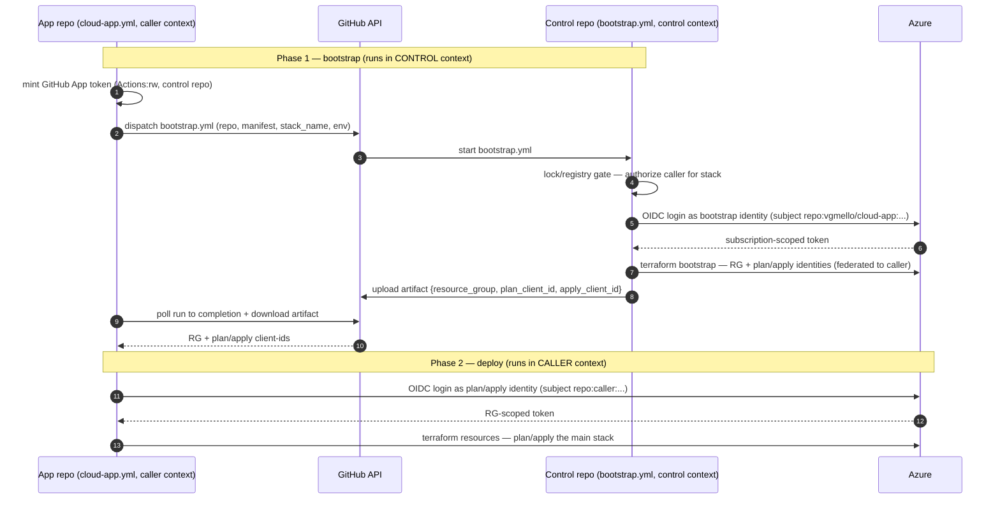

# Trust & identity model

How the platform authenticates to Azure, isolates privilege across deploy
phases, and lets untrusted repos deploy without holding deploy-capable
credentials.

> **Status — wired, not yet validated against live Azure.** The split topology
> is now implemented end to end: the control repo's `bootstrap.yml` runs the
> bootstrap (federating plan/apply to the caller), and the caller's reusable
> `cloud-app.yml` dispatches it, then runs the resource deploy under the
> RG-scoped plan/apply identities. It has **not** been run against a real subscription — OIDC token
> exchange and RBAC propagation after the identities are minted still need a
> sandbox run before relying on the boundary.

## Three deploy identities

Every tool+environment deploys through three managed identities, each with the
least privilege its phase needs:

| Identity                                                    | Scope          | Role                                                                        | Runs                         |
| ----------------------------------------------------------- | -------------- | --------------------------------------------------------------------------- | ---------------------------- |
| `id-cloudapp-bootstrap-<env>` (shared per subscription+env) | subscription   | custom `cloudapp-bootstrap` (create RGs, identities, role assignments only) | the per-tool bootstrap stack |
| `id-<tool>-<env>-plan`                                      | resource group | Reader + Storage Blob Data Reader + Key Vault Reader                        | `terraform plan`             |
| `id-<tool>-<env>-apply`                                     | resource group | Contributor                                                                 | `terraform apply`            |

The bootstrap identity can create the resource group and the two per-RG
identities, and nothing else — it is never Owner and holds no wildcard action.
The plan identity is read-only; only the apply identity writes.

## Two stacks, two state files

Per tool+environment:

- `terraform/azure/bootstrap/` → `<tool>/<env>.bootstrap.tfstate` — the RG and the
  plan/apply identities. Written by the bootstrap identity.
- `terraform/azure/` (main) → `<tool>/<env>.tfstate` — the actual resources. Read by
  the plan identity, written by the apply identity.

## Event-gated phases

- **Pull request** → plan only, under the plan identity. A missing RG just
  yields an all-creates plan.
- **Default branch** → bootstrap identity applies the bootstrap stack, then the
  plan identity plans the main stack, then the apply identity applies it.

`python3 -m cloudapp login-plan --event <event> --platform-file <file>` emits
the exact ordered phases the workflow runs.

## Split topology: control bootstraps, caller deploys

The delegated deploy is split across two execution contexts by privilege:

- **Bootstrap (control repo).** The app repo dispatches the control repo
  (`vgmello/cloud-app`), which runs the subscription-scoped bootstrap under its
  own OIDC — creating the resource group and the per-RG plan/apply identities,
  and federating those identities to the **caller** repo's OIDC subjects. The
  powerful, subscription-level step never leaves the control repo.
- **Resource deploy (caller repo).** The caller then runs the actual deploy
  (plan/apply of the main stack) in its own workflow, under the RG-scoped
  plan/apply identities bootstrap just minted for it. The caller only ever holds
  RG-scoped power (Reader for plan, Contributor for apply on its own RG) — never
  subscription scope.

Federated-credential subjects (written onto the per-tool identities by the
bootstrap stack, sourced from `cloudapp.identity.federation_subjects`):

| Identity  | Federated subject                                         |
| --------- | --------------------------------------------------------- |
| plan      | `repo:<app>:pull_request`, `repo:<app>:environment:<env>` |
| apply     | `repo:<app>:environment:<env>`                            |
| bootstrap | `repo:vgmello/cloud-app:environment:<env>` (control repo) |

The security boundary is scope, not location: the caller can assume plan/apply,
but only for its own resource group. It can never assume the bootstrap identity
(federated to the control repo) and so can never create resource groups,
identities, or role assignments at the subscription. GitHub environment required
reviewers on `environment:<env>` remain the apply approval gate.

## Why a dispatch, not a reusable workflow

The caller's `cloud-app.yml` triggers the bootstrap with a **`workflow_dispatch`
API call** to the control repo's `bootstrap.yml` — not `uses: …/bootstrap.yml`.
This is the crux of the privilege boundary, and it turns on **whose OIDC
identity the job runs under**:

| Mechanism                                   | Runs under                                                                                             |
| ------------------------------------------- | ------------------------------------------------------------------------------------------------------ |
| `uses:` reusable workflow (`workflow_call`) | the **caller's** context — OIDC subject `repo:<caller>:…`                                              |
| `workflow_dispatch` (API trigger)           | the **target's** context — the job runs _in_ the control repo, OIDC subject `repo:vgmello/cloud-app:…` |

The bootstrap identity is subscription-powerful and is federated **only** to
`repo:vgmello/cloud-app:environment:<env>`. A `uses:` call would run bootstrap in
the caller's context, so the OIDC token it mints carries `repo:<caller>:…` —
which does not match the bootstrap identity's federation, so the caller could
never assume it. Dispatch instead runs `bootstrap.yml` **inside** the control
repo, whose OIDC subject _does_ match — so only the control repo's runner can
assume the powerful identity. The caller triggers the powerful step without ever
being able to run it.

Two distinct credentials make this work:

- **GitHub App token** — the _trigger key_ (control plane). Minted by the caller
  from `app-id`/`app-private-key`, scoped to `Actions: read/write` on the control
  repo. It only lets the caller fire and poll `bootstrap.yml`; it is **not** an
  Azure credential and cannot touch the subscription.
- **OIDC identities** — the _Azure auth_ (data plane). Minted inside whichever
  repo's runner is executing: the bootstrap identity inside `bootstrap.yml`, the
  plan/apply identity inside the caller's `cloud-app.yml`.

What the caller may bootstrap is further gated by the lock registry
(`registries/<env>/<stack>.yml`, trust-on-first-use) and GitHub environment
reviewers.

### End-to-end sequence



## State backends (Azure Blob or AWS S3)

`state_backend.type` in `environments/<env>.yml` selects the backend:

```yaml
state_backend:
  type: azurerm # or s3
  resource_group: rg-tfstate
  storage_account: sttfstateprod
  container: tfstate
```

```yaml
state_backend:
  type: s3
  bucket: my-tfstate
  region: us-east-1
  dynamodb_table: tfstate-locks
  role_arn: arn:aws:iam::123456789012:role/gha-tfstate
```

- **azurerm** — reached via `azure/login` OIDC (`use_oidc`, `use_azuread_auth`).
  The state store lives in `rg-tfstate`, outside the tool RG, so the identities
  need data-plane grants **on the state container**: bootstrap+apply → Storage
  Blob Data Contributor, plan → Storage Blob Data Reader. These are now created
  automatically, scoped to the tfstate container: the per-tool bootstrap stack
  grants plan (Reader) and apply (Contributor); the manual
  `terraform/azure/subscription-bootstrap/` stack grants the bootstrap identity
  (Contributor) for its own `bootstrap.tfstate`. Both take the state account id
  from `state_backend` (via `bootstrap-vars`) and are skipped for s3.
- **s3** — reached via `AssumeRoleWithWebIdentity` into `role_arn`. Resources
  stay Azure; the AWS login authorizes only the state backend, so an S3 run
  performs two OIDC logins (AWS for state, Azure for the plan/apply identity).
  The config exposes a single `role_arn` shared by all phases, so S3 state has
  no plan-vs-apply read/write split yet (Azure identities are still separated).

## One-time setup

A subscription owner runs `terraform/azure/subscription-bootstrap/` once per
subscription+environment (see `terraform/azure/subscription-bootstrap/README.md`): it
creates the custom role, the shared bootstrap
identity, and its federated credential, and outputs
`bootstrap_identity_client_id` for `environments/<env>.yml`. Everything after is
automated on deploy.

## Not yet wired (integration remaining)

The logic and Terraform stacks are built and unit-tested, but these connecting
pieces are not implemented yet:

- **Phase handoff (wired).** `cloud-app.yml`'s `bootstrap` job dispatches
  `bootstrap.yml` via `cloudapp-dispatch-workflow`; `deploy-stack` runs the
  bootstrap stack under the bootstrap identity and returns the RG + plan/apply
  client-ids; the deploy job logs in as the plan id (plan-only) or apply id and
  runs the main stack. Remaining gap: docker build still logs in with
  `deploy.client_id` (ACR is shared, outside the tool RG — a separate identity
  concern), and the AWS-state two-login path is not exercised.

- **State-container role assignments (wired).** The bootstrap stacks now create
  the tfstate data-plane grants (plan Reader, apply/bootstrap Contributor),
  scoped to the container. Still needs a live run to confirm RBAC propagates
  before the first `terraform init`.
- **Bootstrap role ABAC** — the bootstrap role assignment constrains
  `roleAssignments/write` to a fixed set of role-definition GUIDs (Reader,
  Contributor, Storage Blob Data Reader/Contributor, Key Vault Reader) via an
  Azure ABAC condition, closing the subscription-scope escalation path.

## Live-only gaps

Even once wired, these need a sandbox integration run to validate: real OIDC
token exchange (Azure + AWS), RBAC propagation timing after the per-tool
bootstrap mints the plan/apply identities, cross-cloud two-login runs, and the
end-to-end deploy workflow.
